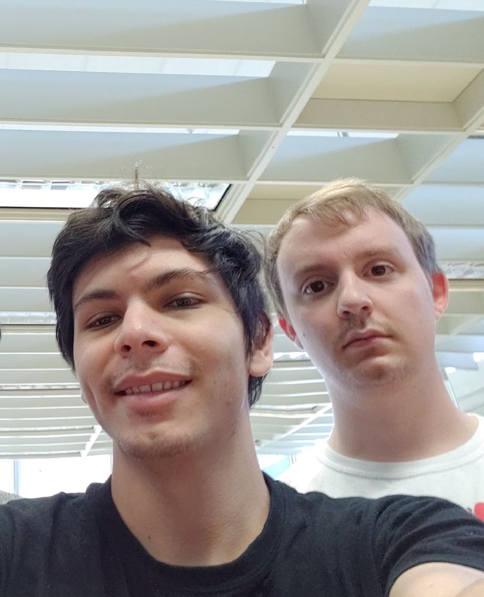
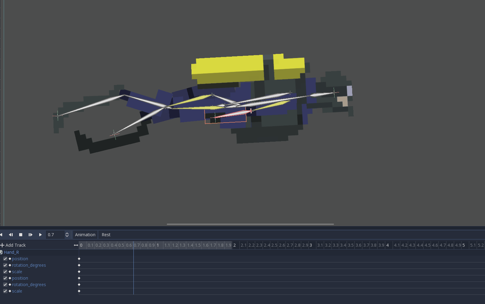
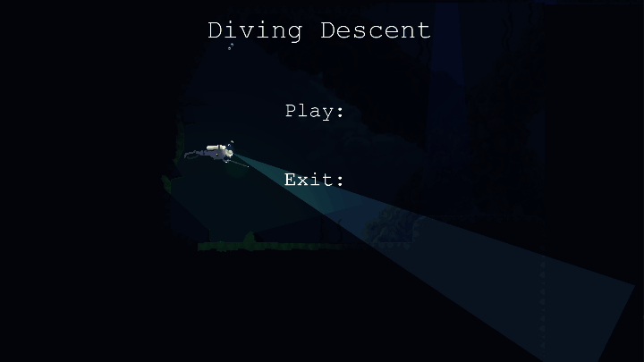

# Project-2-Game-Interface
2D sidescrolling-Rougelite, takes place underwater in a dark cave with limited visibility and limited UI

Introduce members

Luis Sandoval:
Animations, UI, Art

Caleb Horn:
GameDesign, Art, Music

3) Sketch and functions

Pause Menu

Lighting engine:

combat and enemies:

4)How far did you go with the implementation 

Familiarization with the engine

Animations in progress:

5)The Plan to move forward

begin implementation

Finalized Game

Demo Link:

Task Description:
 
 Hypothesis:

